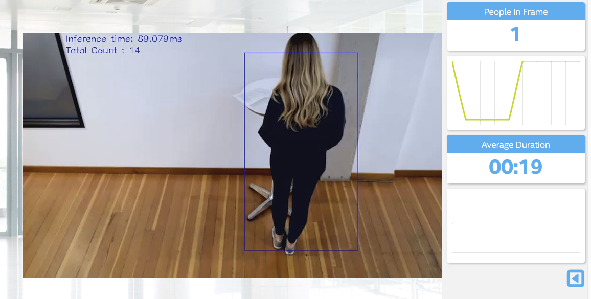
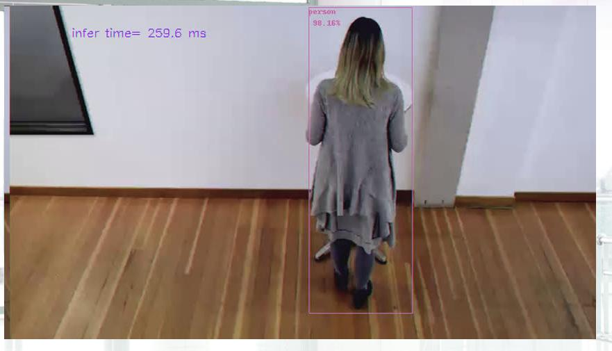

# Project Write-Up

This is Write-Up for "People Counter App at the Edge using OpenVINO" project for my Intel® Edge AI for IoT Developers Nanodegree Program at Udacity.

## Model Research


In investigating potential people counter models, I tried and successfully convert for IR format each of the following models:

- YOLO v3
- YOLO v3 tiny
- ssd mobilenet v2 coco
- faster rcnn inception v2 coco
- person-detection-retail-0013 (from OpenVINO zoo - only for compare)

Different models like YOLO and SSD have different types of output. So I use additional parameter for ```main.py```  and functions for types of models to manage this . **NOTE** .xml and .bin for yolo_v3 are rather big and not included in GitHub repository (should be genrated locally according instructions)

Most of tesing I made with YOLO v3 tiny and ssd mobilenet v2 coco models

```
# ssd mobilenet v2 coco
python3 main.py -i /home/workspace/resources/Pedestrian_Detect_2_1_1.mp4 -m /home/workspace/models/ssd_mobilenet_v2_coco_2018_03_29/frozen_inference_graph_FP16.xml -l /opt/intel/openvino/deployment_tools/inference_engine/lib/intel64/libcpu_extension_sse4.so -d CPU -pt 0.2 --output_type ssd | ffmpeg -v warning -f rawvideo -pixel_format bgr24 -video_size 768x432 -framerate 24 -i - http://0.0.0.0:3004/fac.ffm

# YOLO v3 tiny
python3 main.py -i /home/workspace/resources/Pedestrian_Detect_2_1_1.mp4 -m /home/workspace/models/tensorflow-yolo-v3/frozen_darknet_yolov3_tiny_FP16_model.xml -l /opt/intel/openvino/deployment_tools/inference_engine/lib/intel64/libcpu_extension_sse4.so -d CPU -pt 0.2 --output_type yolo_tiny | ffmpeg -v warning -f rawvideo -pixel_format bgr24 -video_size 768x432 -framerate 24 -i - http://0.0.0.0:3004/fac.ffm
```



### Model 1 - YOLO v3

A deep CNN model for real-time object detection that detects 80 different classes. A little bigger than YOLO2 but still very fast and accurate. 

I get model from this YOLO v3 [repository](https://github.com/mystic123/tensorflow-yolo-v3). Conversion was based on Model Optimizer Developer Guide
[instructions](https://docs.openvinotoolkit.org/2020.3/_docs_MO_DG_prepare_model_convert_model_tf_specific_Convert_YOLO_From_Tensorflow.html)

I use same way like in Intel example ["Object Detection YOLO* V3 Python* Demo, Async API Performance Showcase"](https://github.com/opencv/open_model_zoo/tree/master/demos/python_demos/object_detection_demo_yolov3_async) to get correct bounding boxes output form YOLO. I get ```class YoloParams``` from it and put in ```yoloparams.py```

##### Build instructions:

  
```
# Clone the YOLO v3 repository
git clone https://github.com/mystic123/tensorflow-yolo-v3.git
# Instructions base on commit ed60b90, so I checkout to it
cd tensorflow-yolo-v3
git checkout ed60b90
	
# Download COCO class names file
wget https://raw.githubusercontent.com/pjreddie/darknet/master/data/coco.names
	
#Download binary file with weights (exist 3 option, I use yolov3 and yolov3-tiny)
wget https://pjreddie.com/media/files/yolov3.weights
wget https://pjreddie.com/media/files/yolov3-tiny.weights
wget https://pjreddie.com/media/files/yolov3-spp.weights
	
# Converts yolov3 .weights file to a .pb file
python convert_weights_pb.py --class_names coco.names --data_format NHWC --weights_file yolov3.weights
	
# Convert model to IR format using Model Optimizer
# FP32 model
python /opt/intel/openvino/deployment_tools/model_optimizer/mo_tf.py --input_model frozen_darknet_yolov3_model.pb --tensorflow_use_custom_operations_config /opt/intel/openvino/deployment_tools/model_optimizer/extensions/front/tf/yolo_v3.json --batch 1
# FP16 model
python /opt/intel/openvino/deployment_tools/model_optimizer/mo_tf.py --input_model frozen_darknet_yolov3_model.pb --data_type FP16 --tensorflow_use_custom_operations_config /opt/intel/openvino/deployment_tools/model_optimizer/extensions/front/tf/yolo_v3.json --batch 1 

	
```
During .weights to a .pb conversion I get an several errors like:
	
```
AttributeError: module 'tensorflow.python.ops.nn' has no attribute 'leaky_relu'
and
No module PIL
```
This fixed by installing tensorflow v1.12 and Pillow:
	
```
pip install tensorflow==1.12
pip install numpy --upgrade
pip install Pillow
```
		
Was generated .xml and .bin files for FP16 for testing
	
##### Run main code (FP16): 
**NOTE** .xml and .bin not included in GitHub repository (should be genrated locally first)

```
python3 main.py -i /home/workspace/resources/Pedestrian_Detect_2_1_1.mp4 -m /home/workspace/models/tensorflow-yolo-v3/frozen_darknet_yolov3_model.xml -l /opt/intel/openvino/deployment_tools/inference_engine/lib/intel64/libcpu_extension_sse4.so -d CPU -pt 0.6 -lt 2 | ffmpeg -v warning -f rawvideo -pixel_format bgr24 -video_size 768x432 -framerate 24 -i - http://0.0.0.0:3004/fac.ffm
```

### Model 2 - YOLO v3 tiny

YOLO v3 tiny model use same repoditiry and code like YOLO v3 (see above), but with some differencies: 

##### Converting instructions:

  
```
# Converts yolov3_tiny .weights file to a .pb file
python convert_weights_pb.py --class_names coco.names --data_format NHWC --weights_file yolov3-tiny.weights --output_graph frozen_darknet_yolov3_tiny_model.pb --tiny True
	
# Convert model to IR format using Model Optimizer
# FP32
python /opt/intel/openvino/deployment_tools/model_optimizer/mo_tf.py --input_model frozen_darknet_yolov3_tiny_model.pb --tensorflow_use_custom_operations_config /opt/intel/openvino/deployment_tools/model_optimizer/extensions/front/tf/yolo_v3_tiny.json --batch 1
# FP16
python /opt/intel/openvino/deployment_tools/model_optimizer/mo_tf.py --input_model frozen_darknet_yolov3_tiny_model.pb --data_type FP16 --tensorflow_use_custom_operations_config /opt/intel/openvino/deployment_tools/model_optimizer/extensions/front/tf/yolo_v3_tiny.json --batch 1
	
```	
	
Was generated .xml and .bin files for FP16 for testing


##### Run main code (FP16):

```
python3 main.py -i /home/workspace/resources/Pedestrian_Detect_2_1_1.mp4 -m /home/workspace/models/tensorflow-yolo-v3/frozen_darknet_yolov3_tiny_FP16_model.xml -l /opt/intel/openvino/deployment_tools/inference_engine/lib/intel64/libcpu_extension_sse4.so -d CPU -pt 0.2 --output_type yolo_tiny | ffmpeg -v warning -f rawvideo -pixel_format bgr24 -video_size 768x432 -framerate 24 -i - http://0.0.0.0:3004/fac.ffm
```


### Model 3 - ssd mobilenet v2 coco

Single Stage Detector: real-time CNN for object detection that detects 80 different classes.

I get original model from Tensorflow [detection model zoo](https://github.com/tensorflow/models/blob/master/research/object_detection/g3doc/detection_model_zoo.md)

#####Build instructions:

```
# Download model from Tensorflow detection model zoo and extract it
wget http://download.tensorflow.org/models/object_detection/ssd_mobilenet_v2_coco_2018_03_29.tar.gz
tar -xvf ssd_mobilenet_v2_coco_2018_03_29.tar.gz
cd ssd_mobilenet_v2_coco_2018_03_29

# Convert model to IR format using Model Optimizer
# FP32 model
python /opt/intel/openvino/deployment_tools/model_optimizer/mo.py --input_model frozen_inference_graph.pb --tensorflow_object_detection_api_pipeline_config pipeline.config --reverse_input_channels --tensorflow_use_custom_operations_config /opt/intel/openvino/deployment_tools/model_optimizer/extensions/front/tf/ssd_v2_support.json
# FP16 model
python /opt/intel/openvino/deployment_tools/model_optimizer/mo.py --input_model frozen_inference_graph.pb --data_type FP16 --tensorflow_object_detection_api_pipeline_config pipeline.config --reverse_input_channels --tensorflow_use_custom_operations_config /opt/intel/openvino/deployment_tools/model_optimizer/extensions/front/tf/ssd_v2_support.json

```
Was generated .xml and .bin files for FP16 for testing

##### Run main code:

```
python3 main.py -i /home/workspace/resources/Pedestrian_Detect_2_1_1.mp4 -m /home/workspace/models/ssd_mobilenet_v2_coco_2018_03_29/frozen_inference_graph_FP32.xml -l /opt/intel/openvino/deployment_tools/inference_engine/lib/intel64/libcpu_extension_sse4.so -d CPU -pt 0.2 --output_type ssd | ffmpeg -v warning -f rawvideo -pixel_format bgr24 -video_size 768x432 -framerate 24 -i - http://0.0.0.0:3004/fac.ffm
```


### Model 4 - faster rcnn inception v2 coco

This is a real-time neural network for object instance segmentation that detects 80 different classes. Extends Faster R-CNN as each of the 300 elected ROIs go through 3 parallel branches of the network: label prediction, bounding box prediction and mask prediction.

I get original model from Tensorflow [detection model zoo](https://github.com/tensorflow/models/blob/master/research/object_detection/g3doc/detection_model_zoo.md)

##### Build instructions:

```
# Download model from Tensorflow detection model zoo and extract it
wget http://download.tensorflow.org/models/object_detection/faster_rcnn_inception_v2_coco_2018_01_28.tar.gz
tar -xvf faster_rcnn_inception_v2_coco_2018_01_28.tar.gz
cd faster_rcnn_inception_v2_coco_2018_01_28

# Convert model to IR format using Model Optimizer
# FP32 model
python /opt/intel/openvino/deployment_tools/model_optimizer/mo.py --input_model frozen_inference_graph.pb --tensorflow_object_detection_api_pipeline_config pipeline.config --reverse_input_channels --tensorflow_use_custom_operations_config /opt/intel/openvino/deployment_tools/model_optimizer/extensions/front/tf/faster_rcnn_support.json
# FP16 model
python /opt/intel/openvino/deployment_tools/model_optimizer/mo.py --input_model frozen_inference_graph.pb --data_type FP16 --tensorflow_object_detection_api_pipeline_config pipeline.config --reverse_input_channels --tensorflow_use_custom_operations_config /opt/intel/openvino/deployment_tools/model_optimizer/extensions/front/tf/faster_rcnn_support.json


python /opt/intel/openvino/deployment_tools/model_optimizer/mo.py --input_model frozen_inference_graph.pb --tensorflow_object_detection_api_pipeline_config pipeline.config --reverse_input_channels --tensorflow_use_custom_operations_config /opt/intel/openvino/deployment_tools/model_optimizer/extensions/front/tf/faster_rcnn_support.json

```
Was generated .xml and .bin files for FP16 for testing

```
##### Run main code:

```
python3 main.py -i /home/workspace/resources/Pedestrian_Detect_2_1_1.mp4 -m /home/workspace/models/faster_rcnn_inception_v2_coco_2018_01_28/frozen_inference_graph.xml -l /opt/intel/openvino/deployment_tools/inference_engine/lib/intel64/libcpu_extension_sse4.so -d CPU -pt 0.6 -lt 2 --output_type ssd | ffmpeg -v warning -f rawvideo -pixel_format bgr24 -video_size 768x432 -framerate 24 -i - http://0.0.0.0:3004/fac.ffm
```
I get an error here: Output file is empty, nothing was encoded (check -ss / -t / -frames parameters if used)

### Model 5 - person-detection-retail-0013 (additional model from OpenVINO zoo)

This is additional pre-trained model from OpenVINO zoo, only for comparation

##### Get model from OpenVINO zoo:

```
/opt/intel/openvino/deployment_tools/tools/model_downloader# sudo ./downloader.py --name person-detection-retail-0013 --precisions FP16 -o /home/workspace
```

##### Run main code:

```
python3 main.py -i /home/workspace/resources/Pedestrian_Detect_2_1_1.mp4 -m /home/workspace/models/faster_rcnn_inception_v2_coco_2018_01_28/frozen_inference_graph.xml -l /opt/intel/openvino/deployment_tools/inference_engine/lib/intel64/libcpu_extension_sse4.so -d CPU -pt 0.6 -lt 2 | ffmpeg -v warning -f rawvideo -pixel_format bgr24 -video_size 768x432 -framerate 24 -i - http://0.0.0.0:3004/fac.ffm
```

## Comparing Model Performance

### Methods to compare before and after conversion models

I find next methods to compare models before and after conversion to Intermediate Representations:

1. **Direct Comparison**. - I am using this method in my tests. 

	I can use same sample video to run inference using TensorFlow and get time for it. I will  use `time.time()` exactly before running TensorFlow inference line of code after to get difference. So I will able to calculate common time for whole video. Than I will compare time with OpenVINO results
I can re-use for TensorFlow same opencv code that I use for OpenVINO to load video, get frames, preprocess, etc...
Using `print()` during each frame execution can gives some strange results, so better to use 
`cv2.putText` to put text directly on video

2. **Using DL Workbench** - potential opportunity I still investigate. Mostly it used for tune converted models, but also it can [import](https://docs.openvinotoolkit.org/2020.3/_docs_Workbench_DG_Select_Models.html) original models. It good to know if it able to [compare](https://docs.openvinotoolkit.org/latest/_docs_Workbench_DG_Compare_Performance_between_Two_Versions_of_Models.html) original and converted models. DL Workbench is a web-based graphical environment that enables users to visualize, fine-tune, and compare performance of deep learning models on various Intel® architecture configurations. It can measure accuracy, performance and more metrics
 
 	DL Workbench supports several frameworks whether uploaded from a local folder or imported from the Open Model Zoo. Supported frameworks are: OpenVINO, Caffe, MXNet, ONNX, TensorFlow. For PyTorch DL Workbench supports only pre-trained models from Intel Open Model Zoo. DL Workbench documentation available [here](https://docs.openvinotoolkit.org/2019_R3.1/_docs_Workbench_DG_Introduction.html)


### Original inference using TensorFlow (for compare)

To use Direct comparison method I need to run original inference using TensorFlow. For thia purpose I create file ```yolov3_original```. It need to be copied into yolo v3 filder ```/models/tensorflow-yolo-v3/``` to avoid path problems. It based on original GitHub example [demo.py](https://github.com/mystic123/tensorflow-yolo-v3/blob/master/demo.py) in same foler. I am change a little code and add output to ffmpeg server similar to OpenVINO exanles.

To start original inference using TensorFlow use:

```
cp yolov3_original.py /models/tensorflow-yolo-v3
cd /models/tensorflow-yolo-v3
python3 yolov3_original.py --frozen_model frozen_darknet_yolov3_tiny_model.pb --input_video ../../resources/Pedestrian_Detect_2_1_1.mp4 --tiny True | ffmpeg -v warning -f rawvideo -pixel_format rbg24 -video_size 768x432 -framerate 24 -i - http://0.0.0.0:3004/fac.ffm
```


### Difference between model accuracy pre- and post-conversion

**Accuracy measurement methods** for object detection models : I find that no single definition of metrics for accuracy. Some of the metrics descriptions, such as Precision, Recall and Accuracy I found [here](https://manalelaidouni.github.io/manalelaidouni.github.io/Evaluating-Object-Detection-Models-Guide-to-Performance-Metrics.html) and [here](https://medium.com/@jonathan_hui/map-mean-average-precision-for-object-detection-45c121a31173). Most common used metrics are:

**Precision** is the the probability of the predicted bounding boxes matching actual ground truth boxes, also referred to as the positive predictive value.

 

**Recall** is the true positive rate, also referred to as sensitivity, measures the probability of ground truth objects being correctly detected. 

 

**Accuracy** is the percentage of correctly predicted examples out of all predictions. The accuracy metric results unfortunately can be very misleading when dealing with class imbalanced data. For example where the number of instances is not the same for each classes, as It puts more weight on learning the majority classes than the minority classes. For single class object detection (like detect only "person" class) it can be ok, but if we will detect more classes it possible misleading.

 

where used next notation - **True Positives (TP)**, **False Negatives (FN)**, and **False Positives (FP)**. To determine how many objects were detected correctly and how many false positives were generated, we use the **Intersection over Union (IoU)** metric. The IoU score ranges from 0 to 1, the closer the two boxes, the higher the IoU score. Formally, the IoU measures the overlap between the ground truth box and the predicted box over their union.

I compare models accuracy only visually this time - in my case tensorflow-yolo-v3 (tiny) was better accuracy than ssd-mobilenet-v2-coco. Also Intel pre-trained detection-retail-0013 looks fine


### Size of the model pre- and post-conversion

***Size Comparation method:*** I compare file size of OpenVINO IR .bin vs TensorFlow .bp model frozen graph.

Results:

| Model                  | TensorFlow .bp file | OpenVINO FP32 .bin file | OpenVINO FP16 .bin file |
| ----------------------------- |:-------------------:|------------------------:|-----------------:|
| tensorflow-yolo-v3            | 237Mb               | 236Mb                   | 118Mb            |
| tensorflow-yolo-v3 (tiny)     | 33.8Mb              | 33.8Mb                  | 16.9Mb           |
| ssd-mobilenet-v2-coco         | 66.5Mb              | 64.2Mb                  | 32.1Mb           |
| faster-rcnn-inception-v2-coco | 54.5MB              | 50.8Mb                  | 25.4Mb           |

TensorFlow and OpenVINO FP32 IR models file sizes close to same, but FP16 OpenVINO IR models twice smaller.

### Inference time of the model pre- and post-conversion

***Inference time Comparation method:*** I compare time taken to run inference for one frame (or image) using converted OpenVINO IR model vs using original TensorFlow model. 

Results:

| Model                         | TensorFlow          | OpenVINO FP16    |
| ----------------------------- |:-------------------:| ----------------:|
| tensorflow-yolo-v3 (tiny)     |      260.2 ms       |     90.6 ms      |


Note: original TensorFlow example run in FP32

Command to start TensorFlow example:

```
python3 yolov3_original.py --frozen_model frozen_darknet_yolov3_tiny_model.pb --input_video ../../resources/Pedestrian_Detect_2_1_1.mp4 --tiny True | ffmpeg -v warning -f rawvideo -pixel_format rbg24 -video_size 768x432 -framerate 24 -i - http://0.0.0.0:3004/fac.ffm
```

Command to start OpenVINO example:

```
python3 main.py -i /home/workspace/resources/Pedestrian_Detect_2_1_1.mp4 -m /home/workspace/models/tensorflow-yolo-v3/frozen_darknet_yolov3_tiny_FP16_model.xml -l /opt/intel/openvino/deployment_tools/inference_engine/lib/intel64/libcpu_extension_sse4.so -d CPU -pt 0.2 --output_type yolo_tiny | ffmpeg -v warning -f rawvideo -pixel_format bgr24 -video_size 768x432 -framerate 24 -i - http://0.0.0.0:3004/fac.ffm
```


## Explaining Custom Layers

Custom layers are layers that are not included in the list of known layers. If the topology contains any layers that are not in the list of known layers, the Model Optimizer classifies them as custom. 

In OpenVINO we can register new custom layers as extensions to the Model Optimizer. Or there are several other options specific to the Caffe, TensorFlow, MXNet, and ONIX libraries. This is described in [Custom Layers Guide](https://docs.openvinotoolkit.org/latest/_docs_HOWTO_Custom_Layers_Guide.html) on OpenVINO site

Some of the potential reasons for handling custom layers are:

 - implement missing layers new for cutting-edge topologies
 - to implement them in last layers as regular post-processing in application


Tutorial explains the flow and provides examples for custom layers you can find [here](https://software.intel.com/content/www/us/en/develop/articles/openvino-custom-layers-support-in-inference-engine.html)


## Assess Model Use Cases

Some of the potential use cases of the people counter app :

 - To precisely control the number of people inside indoors. Actual during the pandemic for stores
 - To measure people's interest in advertising screens. You can sell advertising to a client for real views.
 - It can be applied in security systems. To control a person’s presence in a specific area
 - In retail to control attention to specific products

Each of these use cases will be useful, because it is an "automatic" work that may be needed, but people don’t really like it. People need to have opportunity for more creative job.

## Assess Effects on End User Needs

Lighting, model accuracy, and camera focal length/image size have different effects on a
deployed edge model. To get better results, consider the following factors:

 - Lighting: Bad lighting condition can gives significant impact on model accuracy. In most cases you need good light to get good accuracy. Ideally test data distributions, training data distributions and end user lighting condition should be rather close.
 - Model Accuracy: in many cases edge models is need to run in realtime. So usually you need to find balance speed/accuracy. High accurate model can require a lot computer power. some times is good to test different IR precision FP32 or FP16 - this directly affects performance.
 - Camera focal Length and Image Size: Models give the best results if the camera image is close to the image parameters from the data set. Image size should be the same or higher than the resolution of the internal processing. Smaller image sizes degrade image and can give worse results. Too large image size requires more processing power to reduce. Make sure to use the input image mean/scale parameters (--scale and –mean_values) with the Model Optimizer when you need pre-processing. It allows the tool to bake the pre-processing into the IR to get accelerated by the Inference Engine. 
 - Camera position: In addition, the location and viewing angle of the camera can affect performance. If it is located too different from training data cameras, for example too high - you may get poor results

So main recommendation is to test model on real user condition and real data. And re-train model if need.


